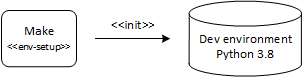
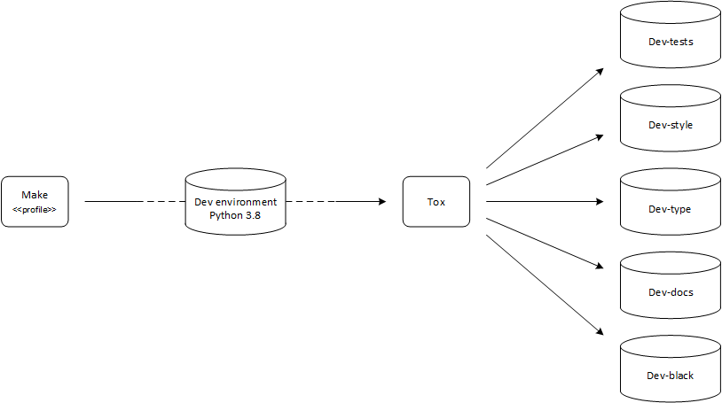
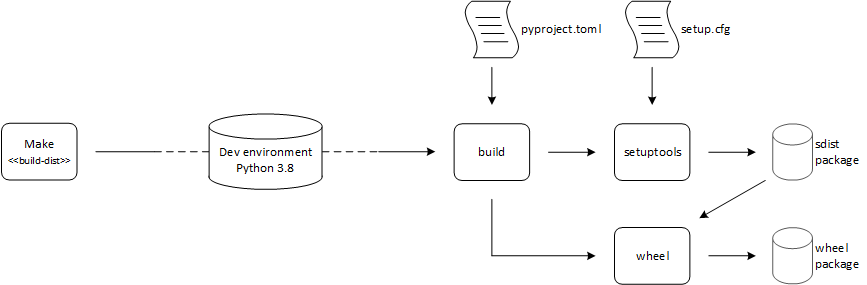
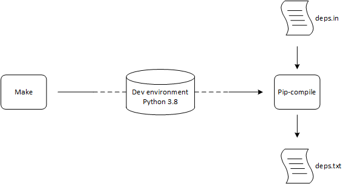

****************
Technology stack
****************

Technology stack break down
===========================

The complete technology stack for developing Python projects at PR electronis 
consists of three major parts:

* Docker
* Make/makefile
* Python packages
 
Docker
------

Docker [17]_ is used for encapsulating the development environment and related
tools to avoid the user to install a group of different tools and software
packages locally prior to developing on the software package. The docker
containter is well defined through configuration files and ensures that all
required development related packages are installed in their correct version at
all time.

Make / Makefile
---------------

The makefile [13]_ defines a set of tasks to be executed when a user issues the
make command. It operates as a frontend that initially creates a development
environment and delegates some tasks to be executed by ``tox`` package (see
below). To bootstrap the Python development a virtual development environment
will be created in the ``.venv`` folder where all the required Python packages
will be installed into and the project itself will be installed in ``editable``
mode. When Python code is installed in editable mode it can used directly
during development without the need for being installed first.
Remember that Python uses virtual environments to encapsulate and isolate an
environment which allows for isolated execution and package dependency.

The make file has three groups of actions:

* Environment Setup
* Test profiles
* Distribution build

Each of the groups are described in the following

Environment Setup
^^^^^^^^^^^^^^^^^

Before any other actions can be done upon the Python development environment it
must be setup. The setup inititates all the required bootstrapping of the
environment and by running the ``make env-setup`` everything is automatically
done. ``env-setup`` calls the below three tasks in the given order and ensures
that the development environment is correctly initiated.

* ``env-clean`` cleans the development environment, this can be called at any
  time to clean up the development environment an start all over again
* ``env-init`` install and updates required Python tools
* ``env-install`` installs the requirements into the development envorinment,
  this includes all the development tools/packages and the devleoped
  application itself in editable mode and required packages from the
  requirements file

Test profiles
^^^^^^^^^^^^^

Continous testing during the development phase is a big part of building
reliable and well defined software and different test suites are required for
testing different aspects of the code base. Python offers different tools to
solve different test tasks and since all tests doesn't need to be run at the
same time during the development phase, tests are divided into test profiles.
Common for all the tests is that they are controlled by the ``tox`` package,
which basically ensures that a test is encapsulated in its own virtual
environment. Every task related to a test profile is delegated through to
``tox`` directly meaning that make task acts a simple proxy.

The different test profiles available are the following:

* ``dev-style`` performs style analysis of the source code
* ``dev-typing`` performs static type check
* ``dev-tests`` runs functional tests based on the associated written test code
* ``dev-coverage`` creates a coverage report, must be called after
  ``dev-tests`` has been called, since the indivudual coverage reports are
  generated by ``dev-tests``
* ``dev-docs`` creates documentation based on code comments and on written
  documentation 
* ``dev-black`` runs the black tool aginst the code located in the ``src``
  folder, be aware that this command alters the contents of the source code

Dev build
^^^^^^^^^

The last section in the makefile handles build related tasks such as generating
the actual binary representation of the software package and mantaining the
dependencies for packages used within the software release and development
environment.

* ``build-dist`` builds the binary distributable package
* ``build-deps`` builds dependencies if new dependencies are being added to the
  project
* ``build-test-deps`` builds dependencies used by test profiles

Development build and dependecy maintainance is described in details in
corresponding section below.

Python tools
------------

Tox
^^^

``tox`` is a tool for automating test cycles against multiple Python version by
encapsulating every task within it's own environment for execution. This allows
for seperation for tests to be performed without interferring with other
ongoing tests. The behaviour of ``tox`` is controlled through the ``tox.ini``
file located in the project root.

The usage of tox orchestres and controls the setup and execution of the
following setups:

* Tests
* Coverage
* Style
* Typing
* Documentation
* Black

Packages used:

* ``tox`` [2]_

Tests
"""""

Tests are run by using ``pytest`` which is a test framework that enables
functional tests to be performed for applications and libraries. ``tox``
combined with ``pytest`` allows for easy test setup and execution against all
required python environments, i.e. py36, py38 and py39.

Packages used:

* ``pytest`` [10]_

Coverage
""""""""

Detailed coverage analysis can be obtained after running tests. The detailed
overview shows which parts of the code that has been exercised by tests.

Packages used:

* ``coverage`` [11]_

Style
"""""

Enforcing code style ensures a clean and consistent code base and four
different style related tools are used: ``black``, ``pydocstyle``, 
``pylint`` and ``flake8``. ``black`` is only used in its 'check-mode', if
``black`` detects any problems it can be run in its normal mode (see Black_).
``black`` uses a few settings stored in the ``pyproject.toml`` file located in
the project root. ``pydocstyle``, ``pylint`` and ``flake8`` has their
configuration files located in the ``configurations`` directory.

Packages used:

* ``black`` [4]_
* ``pydocstyle`` [6]_
* ``pylint`` [7]_
* ``flake8`` [5]_

Typing
""""""

Static type checking is enforced to reduce potential program errors and is done
with the tool ``mypy``. Settings for ``mypy`` is controlled via
``pyproject.toml``. 

Packages used:

* ``mypy`` [1]_

Documentation
"""""""""""""

The documentation is build using the ``sphinx`` tool, ``sphinx`` will create a 
complete documentation package containing code comments and related project
documentation. The typical plaintext markdown language used for Python related
documentation is reStructuredText [14]_ and ``sphinx`` converts code comments
into this format. Other parts of system documentation may be maintained in
Markdown and the ``myst-parser`` package enables integration of
reStructuredText and Markdown documentation into complete docuementation
package.

Packages used:

* ``sphinx`` [8]_
* ``myst-parser`` [9]_

Black
"""""

Black is python formater that will format the code according to PEP-8, this is
an active action that alters the source code.

Packages used:

* ``black`` [4]_

Source distribution and dependency maintanence
----------------------------------------------

The source distribution is seen below and is the typical way of creating a
binary Python package.

The source distribution is created by invoking the ``build`` package which
reads from ``pyproject.toml`` where the versions of ``setuptools`` and
``wheel`` are maintained. First build uses ``setuptools`` to generate the
source distribution (sdist) package. This sdist package is generated with
information from the ``setup.cfg`` file. The sdist package is used for input to
to ``wheel`` which generates the wheel package, which is a binary
representation of the software package and is the usual package that is
distributed. 

Packages used:

* Setuptools [3]_
* Wheel [12]_
* Build [15]_

setuptools and setup.cfg
^^^^^^^^^^^^^^^^^^^^^^^^

``setup.cfg`` contains all the meta data information about the sofwtare package
being created and must be updated to reflect the desired requirements for the
package being build. Packages used by the application must be specified at
``install_requires`` option and specific versions with the ``==`` indicator
should be used, such as ``pandas == 1.1.5``

Pip-tools
^^^^^^^^^

``pip-tools`` is a set of tools that helps keeps ``pip``-based packages up to
date and defines versions used to maintain a well defined Python environment.
When a new package is needed for a development profile, the corresponding
<profile>.in file shall be updated and ``pip-compile`` (``pip-compile`` is a
part of ``pip-tools``) shall be invoked to generate a new <profile>.txt file
which defines all the related packages required for a given profile.

packages used:
* Pip-tools [16]_

References
==========

.. [1] https://pypi.org/project/mypy/
.. [2] https://pypi.org/project/tox/
.. [3] https://pypi.org/project/setuptools/
.. [4] https://pypi.org/project/black/
.. [5] https://pypi.org/project/flake8/
.. [6] https://pypi.org/project/pydocstyle/
.. [7] https://pypi.org/project/pylint/
.. [8] https://pypi.org/project/Sphinx/
.. [9] https://pypi.org/project/myst-parser/
.. [10] https://pypi.org/project/pytest/
.. [11] https://pypi.org/project/coverage/
.. [12] https://pypi.org/project/wheel/
.. [13] https://opensource.com/article/18/8/what-how-makefile
.. [14] https://www.sphinx-doc.org/en/master/usage/restructuredtext/index.html
.. [15] https://pypi.org/project/build/
.. [16] https://pypi.org/project/pip-tools/
.. [17] https://www.docker.com/

